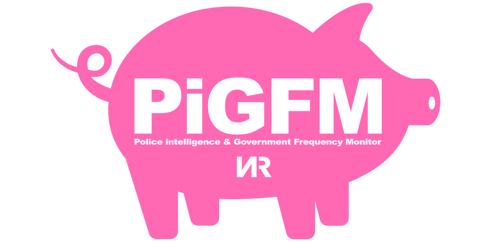
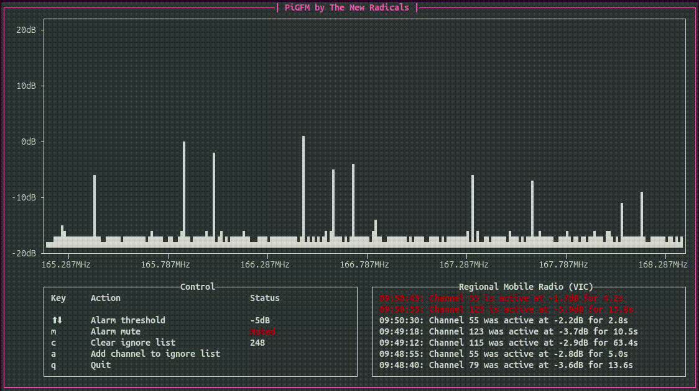

# PiGFM (Police, intelligence & Government Frequency Monitor)

## PiGFM is open source software that turns an old laptop into an ICE / police early warning system for $30

### How PiGFM works
Police, ICE and other government agencies use two-way radio systems that are separate from the mobile phone system.
Their portable handheld radios and mobile vehicle radios transmit back to fixed base stations when the push-to-talk button is pressed. Luckily for us these radios are also typically configured to automatically send location and other information back to base regularly when they're switched on.

PiGFM works by detecting the signals these radios transmit. The 'strength' of these signals correspond roughly to how close the radio is and the software sounds an alarm if a set level is reached, alerting the user to an approaching radio.

### Who it's for
First they came for...

### It's not perfect!
Unfortunately the channels in these systems are typically shared with useful agencies (ambulance service, fire department etc) - PiGFM cannot currently tell the difference.
Some systems also have multiple blocks of channels spread apart in frequency - PiGFM cannot currently receive more than one 'block' of channels at the same time. See the improvements section for ideas about how PiGFM could be made more useful.

### What you'll need
- An old laptop or Raspberry Pi etc. Running Linux
- RTL-SDR compatible USB dongle - a cheap unit will work or you can get a higher quality unit from [RTL-SDR.COM](https://rtl-sdr.com)
- 10dB SMA attenuator (optional). To reduce help prevent overload of the RTL-SDR in high signal environments
- Small antenna with SMA connector

### How to install
In a terminal window run:

Update repositories `sudo apt update`

Install dependencies `sudo apt install libzmq3-dev python3-zmq gnuradio rtl-sdr gr-osmosdr`

Download the program files as a ZIP file and decompress or clone this repository

Run directly `./pigfm.py config/<config_file>.ini` or `python3 pigfm.py config/<config_file>.ini`

These instructions work under Ubuntu and Raspberry Pi OS.

### Edit the configuration file
PiGFM is very new and currently only has one configuration file included. This is for the Regional Mobile Radio network in Victoria, Australia.
Luckily for similar networks all you need to change is the 'centre_freq' section of the configuration file. Unfortunately, however, finding the information you'll need to determine the centre frequency parameter is a bit trickier. You'll need to find the lowest and highest frequencies of the channels you want to monitor. Sometimes the frequencies you'll find will be the base station transmit channels - the system will have a fixed frequency offset (typically 4.5MHz) between transmit and receive and you might have to take this into account when making the setting.

The information for channel allocations is typically publicly available, for example in Australia the [ACMA](https://www.acma.gov.au/register-radiocommunications-licences-rrl) and in the US the [FCC](https://www.fcc.gov/)

Once you've found your lowest and highest frequency the centre frequency can be calculated with:

`number_of_channels = ((highest_freq - lowest_freq) / channel_spacing) + 1`

`centre_freq = lowest_freq + ((number_of_channels / 2) - 0.5) x channel_spacing) + offset`

The channel spacing is typically 12.5kHz. If you've calculated the centre frequency of the base station transmit you'll have to add the offset to get the receive channels (typically 4.5MHz higher)

Web forums for radio scanner users may also be useful sources of information and help. There's also the Radio Resource website which has a page dedicated to RMR [https://www.radioreference.com/db/sid/7679](https://www.radioreference.com/db/sid/7679). If the system you're interested in has a page on this site it's a good start for gathering the necessary information.

Submissions of configuration files for other systems are very welcome.

### How to use
- The main window of the program displays a spectrum view of 256 channels centred on the centre frequency.
- The right-side window shows a log of which channels are currently active in red. Past detection events are shown in white and logged to a file.

The left-side control window displays settings and some status information:
- `⬆/⬇` keys modify the alarm threshold
- `m` key toggles the alarm mute
- `c` key clears the ignore list
- `a` key adds the most recent active channel to the ignore list
- `q` quits the program

Once everything is up and running you might see some channels active in the main window. The receiver is very sensitive and it's possible to pick up signals from a long way off even with a cheap antenna. Active transmitters that are closeby will produce large peaks on the main window - as a rough guide, signals will increase in level 6dB for every halving of the distance between the receiver and transmitter.

You might be able to take the receiver somewhere nearby a transmitter that you know is operating to get a feel for what kind of relationship there is between distance and the observed signal level.

### More info
Although PiGFM was developed to monitor a digital (P25) trunked radio system it doesn't demodulate the channels - this means it will still detect signals in other trunked radio systems like TETRA in the EU and even older analogue systems.

PiGFM is a terminal program so it's lightweight and easy to install for users. The program consists of a GNURadio flowgraph that sets up the receiver, performs an FFT and filtering and then passes the framed data to a Python script. The script is responsible for UI, channel monitoring and alarm etc.

### Improvements
There are a lot of improvements that could be made to PiGFM!
- More config files for specific systems / locations.
- A prebuilt Raspberry Pi image or bootable USB drive with an operating system and PiGFM installed.
- 'Block' scanning - monitor several blocks of channels; this could be accomplished by retuning the receiver back and forth or with multiple receivers.
- Decode metadata from the active channels - even on encrypted channels the radio ID and talk group ID are sent unencrypted. This could be used to differentiate between different users of the trunked radio system. The [OP25](https://github.com/boatbod/op25) project is open source software that can decode and monitor P25 networks. This could possibly be integrated with PiGFM to add these features.